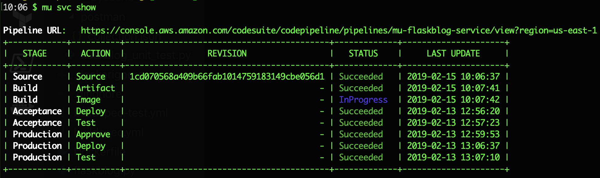

# Deploy AWS Code Pipeline using Mu.
This repository is a sample application for deploying the AWS code pipeline using [mu](https://github.com/stelligent/mu). Below is an overview of the pipeline after the application deployed successfully:


## How to deploy the application

### Prerequisites

1. [Install mu](https://github.com/stelligent/mu/wiki/Installation) on your local machine

    ```bash
    curl -s https://getmu.io/install.sh | sh
    ```

1.  [Install the aws-cli](https://docs.aws.amazon.com/cli/latest/userguide/cli-chap-install.html) and then follow the [aws configure instructions](https://docs.aws.amazon.com/cli/latest/userguide/cli-chap-configure.html#cli-quick-configuration)

1. Make sure you have GitHub token with repo and admin:repo_hook scopes to provide to the pipeline in order to integrate with your GitHub repo.  

### Deploy the application from local machine

1. Clone the repository to your local machine

    ```bash
    git clone git@github.com:<your-github-user-name>/flaskblog.git
    cd flaskblog
    ```

1. Create the pipeline, and enter your github token when prompt:

    ```bash
    mu pipeline up
    ```

### Monitor the status of the pipeline

While the pipeline is creating, you can monitor the status of the pipeline:

```bash
mu svc show

```



### Testing the service

Once the pipeline has completed deployment of the service, it will build and deploy for every commit to your git repo. You can get the information about the ELB endpoint in the acceptance environment to test the service:

```bash
mu env show acceptance

```


If you access the ELB endpoint url, you show see the page displays:


After the acceptance pass the testing, go to the code pipeline, and review and approve the transition to production:


The the changes will be propagate to the production environment. 

## Cleanup

To cleanup the resources that mu created, run the following commands:

```
$ mu pipeline term
$ mu env term acceptance
$ mu env term production
$ mu purge --confirm
```


Test test